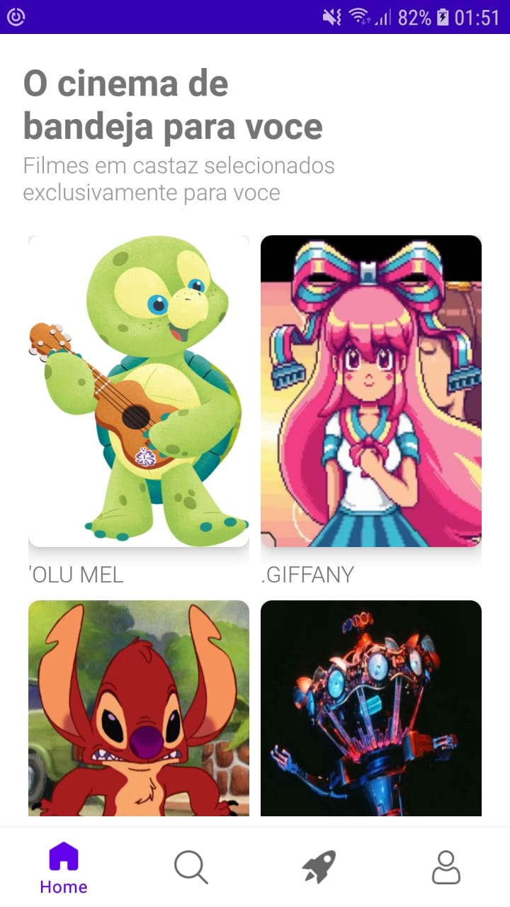
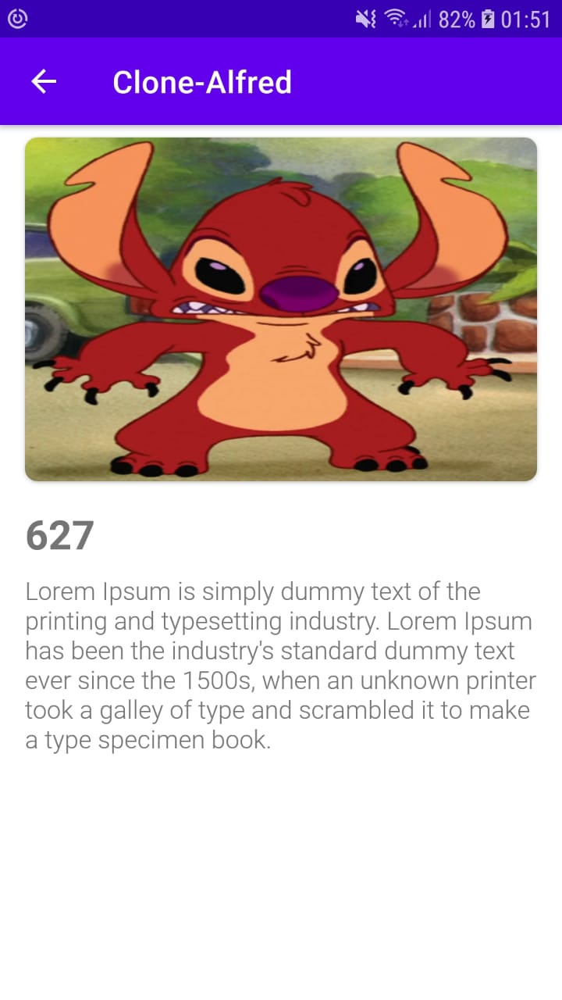

# Clone-Alfred

Função deste projeto esta na exibição de filmes utilizando API-publica no Github, e assim exibir os dados ao usuário final. Ao clicar em uma das imagens o usuário tem acesso as informações sobre o filme em destaque. 

## Screenshots

## Componentes utilizados da Arquitetura JetPack
- [ViewModel](https://developer.android.com/topic/libraries/architecture/viewmodel?hl=pt-br)
- [Navigation](https://developer.android.com/guide/navigation)
- [Retrofit](https://square.github.io/retrofit/)
- [Koin (Injecao de Dependencia)](https://api.disneyapi.dev/characters)
- [DataBinding](https://developer.android.com/topic/libraries/data-binding?hl=pt-br)

## Endpoint
Enpoint utilizado <a href="https://api.disneyapi.dev/characters">Disney </a> para renderizar os dados.
